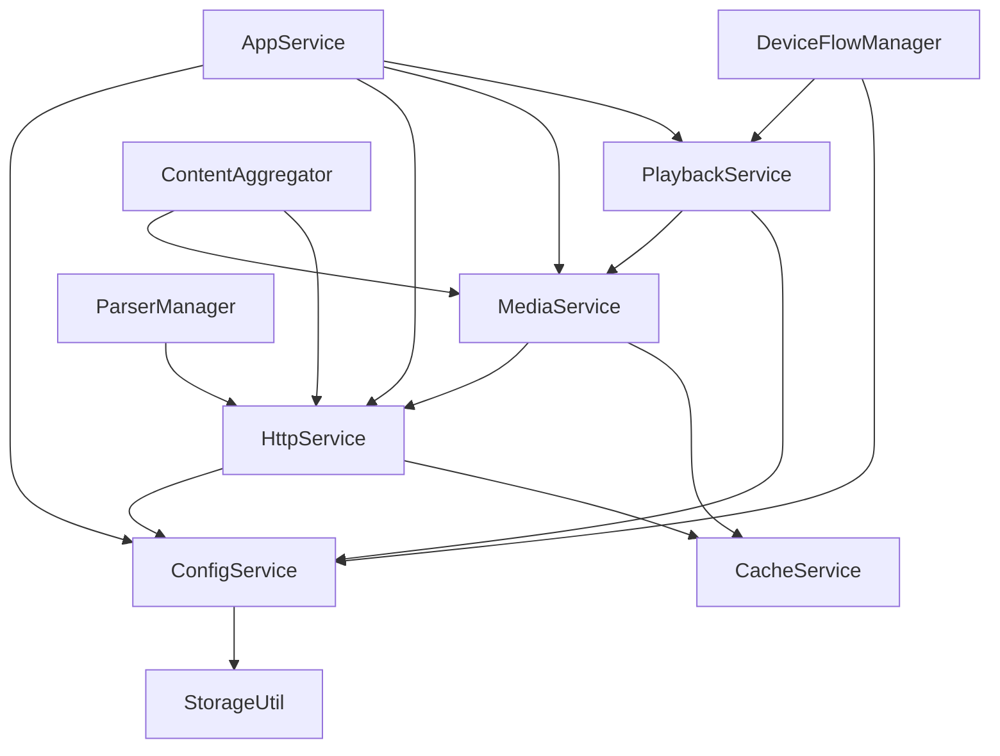

# RayTV 架构设计文档

## 1. 架构概述

RayTV 采用分层架构设计，基于 HarmonyOS 平台，提供高性能、可扩展的多媒体播放应用。整体架构分为表示层、业务逻辑层、服务层和数据层四个主要层次，通过依赖注入实现组件间的解耦，提高系统的可维护性和可测试性。

### 1.1 核心设计原则

- **分层设计**：清晰的层次划分，每一层只负责特定的功能
- **依赖注入**：通过依赖注入容器管理服务实例，减少组件间的耦合
- **服务化**：将核心功能封装为独立服务，提高复用性和可测试性
- **事件驱动**：使用事件总线实现组件间的解耦通信
- **安全性优先**：实现全面的安全措施，包括敏感信息保护、HTTPS通信和输入验证

## 2. 架构层次

### 2.1 表示层（Presentation Layer）

表示层负责用户界面的展示和用户交互的处理，包括以下组件：

- **页面组件**：MainPage、PlaybackPage、SearchPage、SettingsPage等
- **UI组件**：Button、Input、Card、Layout、Icon、Image等
- **视图模型**：MainViewModel、PlaybackViewModel等，负责将业务数据转换为UI友好的格式

### 2.2 业务逻辑层（Business Logic Layer）

业务逻辑层负责处理应用的核心业务逻辑，包括以下组件：

- **业务服务**：ContentAggregator、MediaService、PlaybackService等
- **业务规则**：内容推荐算法、播放控制逻辑等
- **流程协调**：处理跨服务的业务流程

### 2.3 服务层（Service Layer）

服务层提供底层功能的抽象和实现，是业务逻辑层的基础，包括以下服务：

- **配置服务**：ConfigService、ConfigSourceService，负责管理应用配置
- **网络服务**：HttpService，负责处理网络请求
- **缓存服务**：CacheService、MediaCacheService，负责管理缓存
- **媒体服务**：MediaService，负责管理媒体资源
- **解析服务**：ParserManager，负责解析各种格式的数据
- **设备服务**：DeviceFlowManager，负责设备间的媒体流转

### 2.4 数据层（Data Layer）

数据层负责数据的存储和访问，包括以下组件：

- **数据模型**：Config、MediaInfo、PlaybackRecord等
- **数据传输对象**：ApiResponse、ConfigExportItem等
- **数据库**：DatabaseManager，负责本地数据的存储和访问
- **存储工具**：StorageUtil，负责安全存储

## 3. 核心服务依赖关系

### 3.1 服务依赖图

### 3.2 服务依赖详细说明

#### 3.2.1 AppService

- **依赖服务**：ConfigService、HttpService、MediaService、PlaybackService
- **职责**：应用级服务总管理器，负责初始化和协调各个核心服务
- **核心功能**：应用启动流程管理、服务注册和初始化、全局状态管理

#### 3.2.2 ConfigService

- **依赖服务**：StorageUtil
- **职责**：管理应用配置，包括安全存储敏感信息
- **核心功能**：配置读写、安全存储、配置变更通知

#### 3.2.3 HttpService

- **依赖服务**：ConfigService、CacheService
- **职责**：处理网络请求，提供安全的HTTP通信
- **核心功能**：GET/POST请求、HTTPS验证、安全头部设置、缓存策略

#### 3.2.4 MediaService

- **依赖服务**：HttpService、CacheService
- **职责**：管理媒体资源，包括播放历史、收藏和推荐内容
- **核心功能**：播放记录管理、收藏管理、推荐内容获取

#### 3.2.5 PlaybackService

- **依赖服务**：MediaService、ConfigService
- **职责**：处理媒体播放，包括播放控制和状态管理
- **核心功能**：播放控制、音量管理、播放状态管理

#### 3.2.6 ContentAggregator

- **依赖服务**：MediaService、HttpService
- **职责**：聚合来自不同来源的内容
- **核心功能**：内容聚合、分类管理、搜索集成

#### 3.2.7 ParserManager

- **依赖服务**：HttpService
- **职责**：管理各种格式的解析器
- **核心功能**：解析器验证、解析器加载、解析器执行

#### 3.2.8 DeviceFlowManager

- **依赖服务**：PlaybackService、ConfigService
- **职责**：管理设备间的媒体流转
- **核心功能**：设备发现、媒体流转控制、状态同步

## 4. 服务初始化流程

### 4.1 初始化流程概述

1. **应用启动**：AppAbility启动，创建AppService实例
2. **服务注册**：AppService注册所有核心服务到依赖注入容器
3. **服务初始化**：按照依赖顺序初始化服务
4. **配置加载**：ConfigService加载应用配置
5. **网络初始化**：HttpService初始化网络设置
6. **媒体服务初始化**：MediaService初始化媒体资源
7. **播放服务初始化**：PlaybackService初始化播放设置
8. **应用就绪**：所有服务初始化完成，应用进入就绪状态

### 4.2 服务初始化顺序

1. **基础服务**：ConfigService、StorageUtil
2. **核心服务**：HttpService、CacheService
3. **业务服务**：MediaService、PlaybackService
4. **管理器服务**：ContentAggregator、ParserManager、DeviceFlowManager

## 5. 核心调用流程

### 5.1 内容加载流程

1. **用户请求**：用户打开应用或进入特定页面
2. **页面请求**：页面组件请求内容数据
3. **业务服务处理**：ContentAggregator协调内容获取
4. **网络请求**：HttpService发送网络请求获取内容
5. **数据解析**：ParserManager解析返回的数据
6. **缓存处理**：CacheService缓存获取的内容
7. **数据转换**：MediaService转换数据为业务模型
8. **UI更新**：视图模型更新，页面显示内容

### 5.2 媒体播放流程

1. **用户操作**：用户点击播放按钮
2. **播放请求**：页面组件请求播放媒体
3. **播放服务处理**：PlaybackService处理播放请求
4. **媒体信息获取**：MediaService获取媒体详细信息
5. **播放准备**：PlaybackService准备播放器
6. **播放开始**：播放器开始播放
7. **状态更新**：PlaybackService更新播放状态
8. **UI更新**：页面显示播放状态和控制界面

### 5.3 配置更新流程

1. **用户操作**：用户修改应用设置
2. **配置更新**：SettingsPage调用ConfigService更新配置
3. **安全存储**：ConfigService将敏感配置存储到安全存储
4. **配置持久化**：ConfigService保存配置到本地存储
5. **配置变更通知**：ConfigService发送配置变更事件
6. **服务更新**：依赖配置的服务响应配置变更
7. **UI更新**：相关页面更新显示

## 6. 安全性设计

### 6.1 敏感信息保护

- **加密存储**：使用StorageUtil的加密功能存储敏感信息
- **安全配置**：ConfigService中的敏感配置使用安全存储
- **日志脱敏**：网络请求中的敏感信息在日志中脱敏

### 6.2 网络安全

- **HTTPS通信**：所有网络请求强制使用HTTPS
- **安全头部**：设置全面的安全HTTP头部
- **证书验证**：启用HTTPS证书验证
- **输入验证**：对所有网络输入进行严格验证

### 6.3 输入安全

- **XSS防护**：防止跨站脚本攻击
- **SQL注入防护**：防止SQL注入攻击
- **路径遍历防护**：防止路径遍历攻击
- **SSRF防护**：防止服务器端请求伪造攻击

## 7. 性能优化

### 7.1 缓存策略

- **多级缓存**：实现内存缓存和磁盘缓存
- **智能缓存**：基于内容类型的缓存策略
- **预加载**：对常用内容进行预加载
- **缓存过期**：实现合理的缓存过期策略

### 7.2 网络优化

- **请求合并**：合并多个相关请求
- **批量操作**：支持批量数据操作
- **重试机制**：实现智能的网络请求重试机制
- **超时控制**：合理的网络请求超时设置

### 7.3 内存管理

- **对象池**：复用频繁创建的对象
- **内存监控**：监控内存使用情况
- **资源释放**：及时释放不再使用的资源
- **虚拟列表**：对大数据集使用虚拟列表

## 8. 扩展性设计

### 8.1 插件系统

- **解析器插件**：支持自定义内容解析器
- **数据源插件**：支持自定义内容数据源
- **功能插件**：支持扩展应用功能

### 8.2 配置系统

- **动态配置**：支持运行时配置更新
- **配置源**：支持从多个源加载配置
- **配置验证**：对配置进行验证和纠错

### 8.3 服务扩展

- **服务注册**：支持运行时注册新服务
- **服务替换**：支持替换默认服务实现
- **服务装饰**：支持对现有服务进行装饰增强

## 9. 测试策略

### 9.1 单元测试

- **服务测试**：对核心服务进行单元测试
- **工具测试**：对工具类进行单元测试
- **组件测试**：对UI组件进行单元测试

### 9.2 集成测试

- **服务集成测试**：测试服务间的交互
- **流程集成测试**：测试完整业务流程
- **边界测试**：测试边界条件和异常情况

### 9.3 性能测试

- **负载测试**：测试系统在高负载下的表现
- **响应时间测试**：测试系统响应时间
- **内存使用测试**：测试内存使用情况

## 10. 部署与维护

### 10.1 部署策略

- **应用打包**：合理的应用打包策略
- **资源管理**：优化应用资源
- **版本管理**：语义化版本控制

### 10.2 监控与日志

- **应用日志**：详细的应用日志
- **性能监控**：实时性能监控
- **错误监控**：错误收集和分析

### 10.3 升级与迁移

- **配置迁移**：支持配置的版本迁移
- **数据迁移**：支持数据的版本迁移
- **平滑升级**：实现应用的平滑升级

## 11. 技术栈

### 11.1 核心技术

- **开发语言**：ArkTS
- **开发框架**：HarmonyOS SDK
- **网络库**：@ohos.net.http
- **存储库**：@ohos.data.preferences
- **安全库**：@ohos.security.cryptoFramework

### 11.2 第三方依赖

- **测试框架**：@ohos/hypium
- **UI组件**：自定义组件库

## 12. 架构演进

### 12.1 当前架构优势

- **模块化**：清晰的模块划分，便于维护
- **可测试**：依赖注入和服务化设计，便于测试
- **可扩展**：插件系统和服务扩展机制，便于扩展
- **安全**：全面的安全措施，保障应用安全

### 12.2 未来演进方向

- **微服务化**：进一步拆分核心服务为微服务
- **容器化**：探索容器化部署可能性
- **AI集成**：集成AI技术提升用户体验
- **边缘计算**：探索边缘计算在媒体处理中的应用

## 13. 结论

RayTV 采用分层架构设计，结合依赖注入、事件驱动和服务化等现代软件设计理念，构建了一个高性能、可扩展、安全的多媒体播放应用。通过清晰的层次划分和服务依赖关系，提高了系统的可维护性和可测试性。同时，全面的安全性设计和性能优化措施，保障了应用的安全性和用户体验。

未来，RayTV 将继续演进架构，探索新技术和新方法，不断提升应用的性能、可靠性和用户体验。
