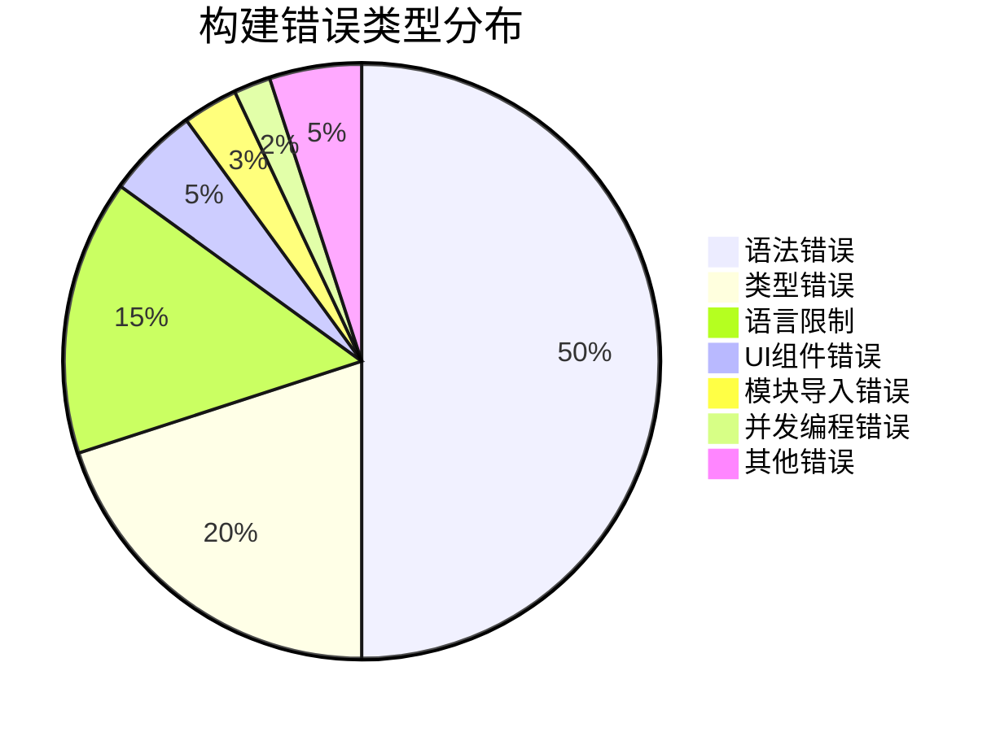
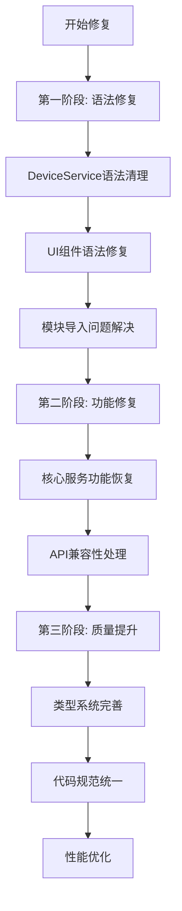

# RayTV构建错误分布可视化

## 错误分布饼图



## 主要文件错误数量排行

```mermaid
bar
    title Top 10 错误最多文件
    "DeviceService.ets" : 1000
    "HttpService.ets" : 200
    "爬虫相关文件" : 200
    "ConfigService.ets" : 80
    "页面组件文件" : 50
    "工具类文件" : 50
    "缓存服务" : 30
    "数据库相关" : 20
    "任务池管理" : 20
    "数据仓库" : 20
```

## 错误严重程度矩阵

| 文件/模块 | 语法错误 | 功能影响 | 修复难度 | 优先级 |
|-----------|----------|----------|----------|--------|
| DeviceService.ets | 高(1000+) | 严重 | 高 | 紧急 |
| HttpService.ets | 中(200+) | 严重 | 中 | 紧急 |
| 爬虫服务 | 中(200+) | 中等 | 中 | 重要 |
| 配置服务 | 中(80+) | 中等 | 低 | 重要 |
| 页面组件 | 低(50+) | 轻微 | 低 | 改善 |
| 工具类 | 低(50+) | 轻微 | 低 | 改善 |

## 修复路径图



## 时间估算

| 阶段 | 工作内容 | 预估时间 | 人员需求 |
|------|----------|----------|----------|
| 第一阶段 | 语法错误修复 | 3-5天 | 2名开发者 |
| 第二阶段 | 功能性错误修复 | 5-7天 | 2名开发者 |
| 第三阶段 | 代码质量提升 | 3-4天 | 1名开发者 |
| **总计** | **完整修复** | **11-16天** | **2-3名开发者** |

## 关键风险点

⚠️ **DeviceService.ets文件过于复杂**: 单个文件错误过多，可能需要拆分重构
⚠️ **第三方库兼容性**: 某些JavaScript特性无直接替代方案
⚠️ **团队学习成本**: ArkTS新规范需要适应时间
⚠️ **回归测试**: 修复后需要全面的功能验证